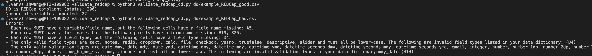

## Background
This simple app leverages the REDCap API to validate the metadata (aka data dictionary) of a REDCap project. 

## Setup
In order to run the app, you will need to create a `.env` file in the root directory of the project. The `.env` file should contain the `API_URL` from Control Center and the `API_TOKEN` generated at the project level.

#### example `.env` 
```
API_URL=https://redcap.yourinstitution.edu/api/
API_TOKEN=your-project-specific-token
```

## Running the app
First, set up and activate virtual environment
```
python3 -m venv .venv   
source .venv/bin/activate    
pip install --upgrade pip
pip install -r requirements.txt
```

Then, run the app with the following command:
```
python3 validate_redcap_dd.py /path/to/redcap_dd.csv
```

## Result
If the data dictionary is not compliant, the app will help identify the problem as shown in this screenshot:


